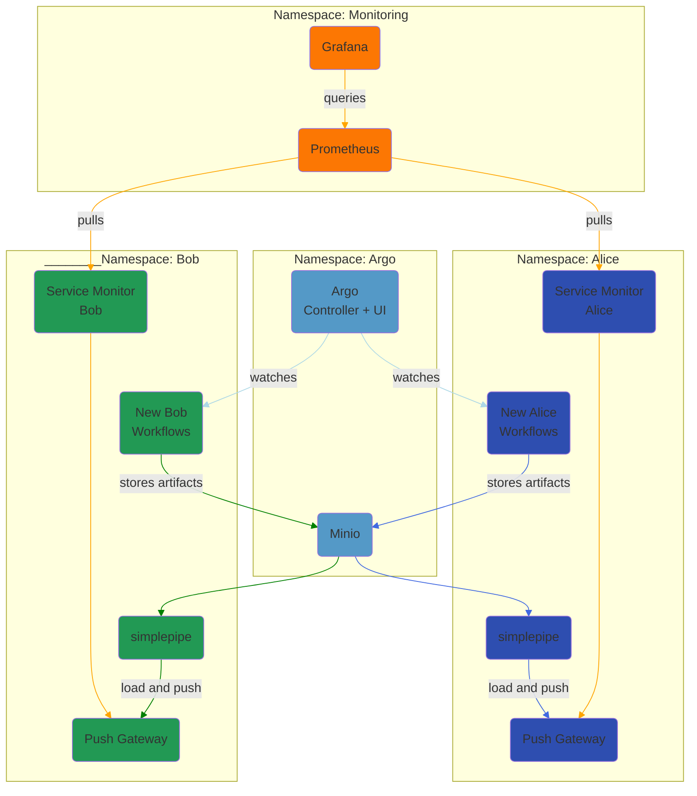

```mermaid
flowchart TB;


%% Kube-prom-stack labels
prometheus(Prometheus)
grafana(Grafana)

%% Argo labels
argowf(Argo\nController + UI)
minio(Minio)
%%postgres[(PostgreSQL)]


%% Bob labels
argowf_bob(New Bob\nWorkflows)
pgbob(Push Gateway)
svcmon_bob(Service Monitor)
simplepipe_bob(simplepipe)

%% Alice labels
argowf_alice(New Alice\nWorkflows)
pgalice(Push Gateway)
svcmon_alice(Service Monitor)
simplepipe_alice(simplepipe)

%% Links
%% Links add hyperlinks to nodes
%% Sub-graphs
subgraph Namespace-Argo [Namespace: Argo]
    argowf
    minio
end

subgraph Namespace-Bob [________Namespace: Bob]
    svcmon_bob(Service Monitor\nBob)
    %%argowf_bob -- submits --> argowf
    argowf -- watches --> argowf_bob
    argowf_bob -- stores artifacts --> minio
    minio --> simplepipe_bob -- load and push --> pgbob
end

subgraph Namespace-Alice [Namespace: Alice]
    svcmon_alice(Service Monitor\nAlice)
    %%argowf_alice -- submits --> argowf
    argowf -- watches --> argowf_alice
    argowf_alice -- stores artifacts --> minio
    minio --> simplepipe_alice -- load and push --> pgalice
end


%% Main graph

subgraph Namespace-Monitoring [Namespace: Monitoring]
    grafana -- queries --> prometheus
    prometheus -- pulls --> svcmon_bob -----> pgbob
    prometheus -- pulls --> svcmon_alice -----> pgalice
end

    %% Styling
    %% colors
    classDef green fill:#229954
    classDef grey fill:#7B7D7D;
    classDef lightblue fill:#5499C7;
    classDef darkgreen fill:#266112;
    classDef royalblue fill:#2e4eb0;
    classDef red fill:#d44444;
    classDef orange fill:#fc7703

    %% mappings to variables
    class argowf lightblue
    class minio lightblue
    class prometheus orange
    class grafana orange

    class svcmon_bob green
    class argowf_bob green
    class simplepipe_bob green
    class pgbob green

    class svcmon_alice royalblue
    class argowf_alice royalblue
    class simplepipe_alice royalblue
    class pgalice royalblue

    %% Lines
    %% argo
    linkStyle 0 stroke-width:1px,fill:none,stroke:lightblue;
    linkStyle 4 stroke-width:1px,fill:none,stroke:lightblue;

    %% bob
    linkStyle 1 stroke-width:1px,fill:none,stroke:green;
    linkStyle 2 stroke-width:1px,fill:none,stroke:green;
    linkStyle 3 stroke-width:1px,fill:none,stroke:green;

    %% alice
    linkStyle 5 stroke-width:1px,fill:none,stroke:royalblue;
    linkStyle 6 stroke-width:1px,fill:none,stroke:royalblue;
    linkStyle 7 stroke-width:1px,fill:none,stroke:royalblue;

    %% prometheus
    linkStyle 8 stroke-width:1px,fill:none,stroke:orange;
    linkStyle 9 stroke-width:1px,fill:none,stroke:orange;
    linkStyle 10 stroke-width:1px,fill:none,stroke:orange;
    linkStyle 11 stroke-width:1px,fill:none,stroke:orange;
    linkStyle 12 stroke-width:1px,fill:none,stroke:orange;
```