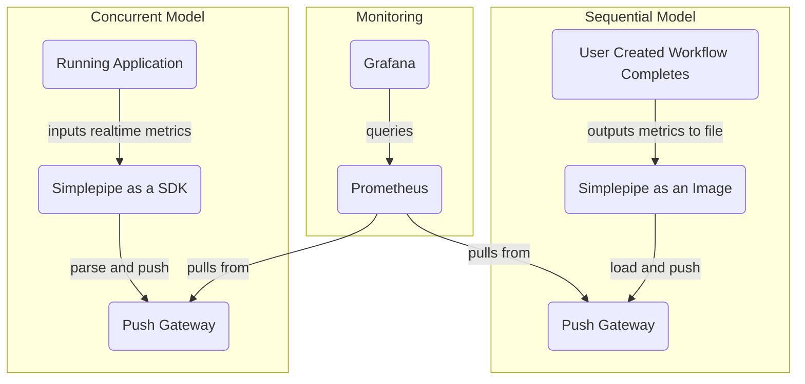

```mermaid
flowchart TB;

P(Prometheus)
G(Grafana)


subgraph Sequential [Sequential Model]
    S1(User Created Workflow Completes) -- outputs metrics to file --> S2(Simplepipe as an Image) -- load and push --> PGS(Push Gateway)

end

subgraph Concurrent [Concurrent Model]
    C1(Running Application) -- inputs realtime metrics --> C2(Simplepipe as a SDK) -- parse and push --> PGC(Push Gateway)
end

subgraph Monitoring
    G -- queries --> P -- pulls from --> PGC & PGS
end
```