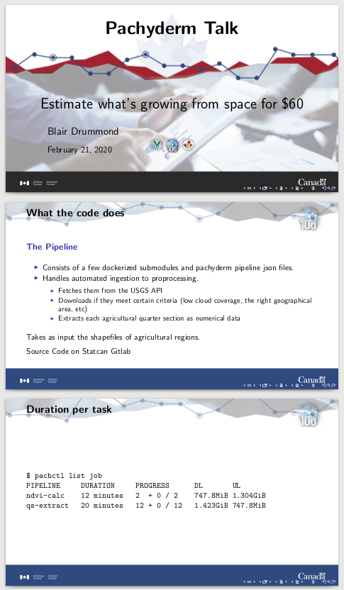

# Create nice slides with Pandoc!

Simply fork this repo and edit the `content.md` file to your needs!

You can generate a new template run `make template`.

To build your presentation, simply run `make`.

**This is real beamer, so TeX works too! No need to stick to markdown!**



## Requirements

``` sh
pandoc
texlive
make
poppler-utils
inotify-tools (optional)
```


## `make dev`

If you have `inotify-tools` installed (`apt install inotify-tools`) then you can also use `make dev` to watch the `content.md` file, and the pdf will automatically be recompiled and updated every time you save the content.md file.
